# <i class="icon-beaker"></i> 3X Tutorial with Examples

In this document, we explain how you can setup and conduct computational
experiments using a few examples.  This step-by-step guide will introduce
important features of 3X with detailed instructions.

## Example 1: Studying Sorting Algorithms

Anyone who received computer science education or studied basic algorithms
would be familiar with different algorithms for sorting an array of data
values.  In the algorithms textbook, we learn how to analyze time and space
complexities of such algorithms in terms of their asymptotic behavior.
Theoretical analyses of worst or best cases can be covered clearly in text, but
average cases require empirical studies experimenting with actual
implementations.

Suppose we want to see such an empirical result ourselves of how different
sorting algorithms, namely, *bubble sort*, *selection sort*, *insertion sort*,
*quick sort*, and *merge sort* behave on several sizes and types of inputs,
e.g., when the input is already ordered, reversed, or randomly shuffled.
Implementing these algorithms correctly is obviously important, but what's
equally important to obtain a credible result is running different combinations
of inputs and recording every detail in a systematic manner.  Using 3X, we can
easily obtain robust, repeatable experimental results with minimal effort.
Therefore more of our time and energy can be devoted to exploring the parameter
space as well as writing the program correctly, which leads our experiments to
yield more interesting results and less errors.

### 1. Write the Program
First of all, we need to write a program that implements the sorting algorithms
we want to test.  Some people may prefer using a serious programming language,
such as C, C++, or Java to write an efficient implementation.  Others may use
simpler scripting languages, such as Python, Ruby or Perl for a quick
evaluation.  But in the end, there will always be an executable file, or a
command and a list of arguments to start our program regardless of the
programming language of choice.  This is the only thing 3X needs to know about
the program for our experiment, and we will see where this information should
be placed after we create an *experiment repository* in the following step.

To keep this tutorial simple, let's assume we already wrote Python code for
experimenting with sorting algorithms as following two files:

* [`sort.py`][]
    containing each sorting algorithm as a separate Python function.

* [`measure.py`][]
    containing code that measures how long a chosen sorting algorithm takes to
    finish for a generated input.

[`sort.py`]:    ../examples/sorting-algos/program/sort.py
[`measure.py`]: ../examples/sorting-algos/program/measure.py

To obtain a single measurement with this program, we would a run command such
as:

    python measure.py quickSort 10 random

which outputs, for instance:

    ratio sorted: 1.0
    sorting time (s): 0.009179
    verification time (s): 0.000225
    input generation time (s): 0.000580
    number of compares: 11440
    number of accesses: 30735

### 2. Create and Setup an Experiment Repository

In order to keep everything related to our experiment well organized, we need
to tell 3X to create a new *experiment repository* for us.  Every detail from
the definition of input/output and program to the individual records of past
executions and plans for future runs will be stored and managed inside this
repository.  It is a typical directory (or folder) on the filesystem with a
special internal structure.

3X provides two different ways to setup a new experiment repository: a quick
one-liner setup, or a slightly more lengthy step-by-step way.  The quick setup
will be useful for creating entirely new experiments from scratch, while the
step-by-step setup can be useful for adjusting your existing experiment
definitions.  You can either follow the first "Quick Setup" section and skip
the rest, or follow the individual steps introduced in the sections that
follows "Quick Setup".  In either ways, let's say we want our repository to be
called `sorting-algos`.  

#### Quick Setup

The single command shown below will create and setup a new repository for our
experiment on sorting algorithms.  It is simply an abbreviation for the
multiple steps necessary to initialize the experiment repository and define its
input and output.

    # create and setup a new experiment repository
    3x setup sorting-algos \
        --program \
            'python measure.py $algo $inputSize $inputType' \
        --inputs \
            inputSize=10,11,12,13,14,15,16,17,18 \
            inputType=random,ordered,reversed \
            algo=bubbleSort,selectionSort,insertionSort,quickSort,mergeSort \
        --outputs \
            --extract 'sorting time \(s\): {{sortingTime(s) =~ .+}}' \
            --extract 'number of compares: {{numCompare =~ .+}}' \
            --extract 'number of accesses: {{numAccess =~ .+}}' \
            --extract 'ratio sorted: {{ratioSorted =~ .+}}' \
            --extract 'input generation time \(s\): {{inputTime(s) =~ .+}}' \
            --extract 'verification time \(s\): {{verificationTime(s) =~ .+}}' \
        #

Note that since this quick setup command creates only the skeleton part of our
experiment repository, we still need to place additional files at the right
place, namely, the `.py` files of our program.  Refer to the [instructions for
plugging the program in to 3X (§2.3)](#plugintheprogram) to prepare the `program/`
directory.  You can safely ignore the rest of the steps, since they were
already taken care by the `3x setup` command above.  We'll all set to start
running our experiment.

#### 2.1. Create an Experiment Repository

The following command creates an empty repository:

    3x init sorting-algos

We can now move into the repository to further define our experiment.

    cd sorting-algos

#### 2.2. Define Inputs & Outputs
Next, we shall tell 3X what are the input parameters to our experimental
program, and the output values of interest.

Suppose we want to vary the input size, the initial order of input for
different sorting algorithms.  We can tell 3X that we have three input
parameters for our experiment in the following steps.

##### Input 1. `algo` for choosing the sorting algorithm to test

The particular sorting algorithms we are interested in are the following
five, which are already implemented in [`sort.py`][].  We will use the name
of the algorithms as the value for this input parameter.

* `bubbleSort`      for [Bubble Sort](http://en.wikipedia.org/wiki/Bubble_sort#Pseudocode_implementation)
* `selectionSort`   for [Selection Sort](http://en.wikipedia.org/wiki/Selection_sort)
* `insertionSort`   for [Insertion Sort](http://en.wikipedia.org/wiki/Insertion_sort#Algorithm)
* `quickSort`       for [Quick Sort (in-place version)](http://en.wikipedia.org/wiki/Quicksort#In-place_version)
* `mergeSort`       for [Merge Sort (bottom-up implementation)](http://en.wikipedia.org/wiki/Merge_sort#Bottom-up_implementation)

The following command tells 3X to add this parameter to the experiment definition:

    3x define input  algo  bubbleSort selectionSort insertionSort quickSort mergeSort 

##### Input 2. `inputSize` for choosing the size of the array to sort

We want to test sorting algorithms on arrays of numbers with different
sizes.  We will start with arrays of 1,024 (2<small>10</small>)
unique numbers, and double the size of the arrays up to size 262,144
(2<small>18</small>).  Let's omit the base and use the powers of
two as the value for this input parameter:

* `10` for 2<small>10</small>,
* `11` for 2<small>11</small>,
* ...,
* `18` for 2<small>18</small>.

We should run the following command to add this parameter:

    3x define input  inputSize  10 11 12 13 14 15 16 17 18

##### Input 3. `inputType` for choosing the type of the arrays to sort

We also want to see how each sorting algorithm behaves differently for
different types of arrays as well as their sizes.  We will use the
following three values of this input parameter to indicate which type of
input we want to use:

* `ordered` that is already sorted,
* `reversed` that is sorted but in the reversed direction,
* `random` that is shuffled randomly.

The following command will add this last parameter:

    3x define input  inputType  ordered reversed random

Next, suppose we want to measure the wall clock time as well as the number of
compares and array accesses to finish each sorting algorithm.  We can tell
3X to look for lines that match specific patterns in the output of our program
to extract the values of interest.  These patterns can be specified in [Perl
regular expressions](http://perldoc.perl.org/perlre.html#Regular-Expressions)
syntax.  The following steps will show how exactly we can tell 3X to extract
the values of interest in the case of this experiment with sorting algorithms.

##### Output 1. `sortingTime`

The wall clock time it takes for sorting the input array is what we are
mostly interested in this experiment.  We measure this time in our program
in seconds and print that out in a line that begins with `sorting time (s):
`.  Therefore 3X can easily extract the value that follows if we define the
output variable as shown in the following command:

    3x define output  'inputTime(s)'  extract  'sorting time \(s\): '  '.+'  ''

Here, there are four arguments to the `3x define output` command:

1. name of the output variable: `inputTime(s)`
2. regular expression for the text that comes before the value: `sorting time \(s\): `
3. regular expression the value matches: `.+` (any non-empty string)
4. regular expression for the text that comes after the value: (empty string)

Note that we can append the *unit* of the output variable to its name
(first argument), which is `(s)` or seconds in this case.  We can use any
text for the unit as long as it's surrounded by parentheses.

##### Output 2. `numCompare`

Similarly, we can teach 3X to extract the number of compares for the value
of an output variable using the following command:

    3x define output  'numCompare'  extract  'number of compares: '  '.+'  ''

##### Output 3. `numAccess`

As well as the number of accesses to the input array of numbers with:

    3x define output  'numAccess'  extract  'number of accesses: '  '.+'  ''

##### Output 4. `ratioSorted`

To ensure correctness, note that we compute the ratio of the numbers in the
array that are correctly ordered to the array size, after finishing the
sorting algorithm.  This is a simple measure to easily check whether the
sorting algorithm was implemented correctly.  When this value comes out
less than 1.0, it means the the algorithm is incorrect.  The following
command adds this output variable to the experiment definition.

    3x define output  'ratioSorted'  extract  'ratio sorted: '  '.+'  ''

##### Output 5. `inputTime`

We also record the wall clock time that took for generating the input array
to sort.

    3x define output  'inputTime(s)'  extract  'input generation time \(s\): '  '.+'  ''

##### Output 6. `verificationTime`

And the wall clock time that took for checking whether the output array is
correctly sorted.

    3x define output  'verificationTime(s)'  extract  'verification time \(s\): '  '.+'  ''

#### 2.3. Plug in the Program

The only thing 3X needs to know about our program in order to run experiments
on behalf of us is the exact command we type into our terminal to start them
ourselves.  3X assumes this information is kept as an executable file named
**`run`** under the `program/` directory of the experiment repository.  For
each execution of `run`, 3X sets up the environment correctly, so that the
value chosen for each input variable we defined earlier can be accessed via the
environment variable with the same name.  3X will also make sure any additional
files that are placed next to the `run` executable will also be available in
the current working directory while execution.

First, let's move into the `program/` directory of our repository:

    cd program

As we have two Python files necessary for implementing and measuring the
sorting algorithms, we will put both of these files under `program/`.  If you
don't have these files readily available, let's download them directly from
GitHub with the following commands:

    # copy our example Python program into the repository
    exampleURL="https://raw.github.com/netj/3x/master/docs/examples/sorting-algos"
    curl -LO $exampleURL/program/measure.py
    curl -LO $exampleURL/program/sort.py

(You can probably use `wget` instead of `curl -LO` if your system doesn't have
`curl` installed.)

Next, we need to create a `run` script that starts our Python program as
follows:

    cat >run  <<EOF
    #!/bin/sh
    python measure.py $algo $inputSize $inputType
    EOF
    chmod +x run

Now, we're all set to start running our experiment.

### 3. Run Experiments

3X provides two ways to execute your experiments: You can use its *graphical
user interface (GUI)*, or the *command-line interface (CLI)*.  The GUI is easy
and intuitive to use, but you might want to have more sophisticated control
over your execution, or control 3X from other systems and further automate
parts of your experiment using the CLI.  However, it is perfectly fine for you
to use both GUI and CLI at the same time, and any changes you make on one-side
will be reflected to the other.

#### 3.1. Start GUI

To start the GUI, run the following command within the experiment repository:

    3x gui

When successfully started, it will output a URL you can open in your web
browser to access the GUI.  On a Mac, or a GNU/Linux system running a proper
GUI system, 3X will launch the browser for you.

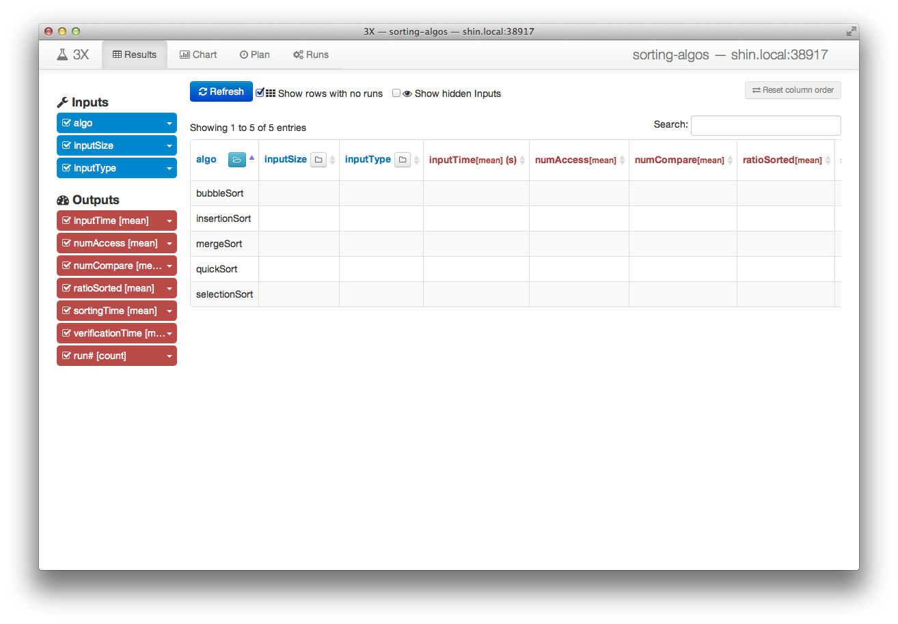

As shown in the above screenshot, the GUI has four tabs: Results, Charts, Plan,
and Runs.  The first two tabs are for exploring the results of execution
collected so far, while the last two are for controlling the execution.

#### 3.2. Queue Runs

From the results table, we can click on a row which needs to be filled or more
execution should be done, and queue up new runs for execution.  You can repeat
this process from the results table to add necessary runs to fill the output
columns colored red.  Note that the button on each input column header can be
used to expand and collapse the rows, so that you can add only part of the runs
or a larger group of runs at a time.

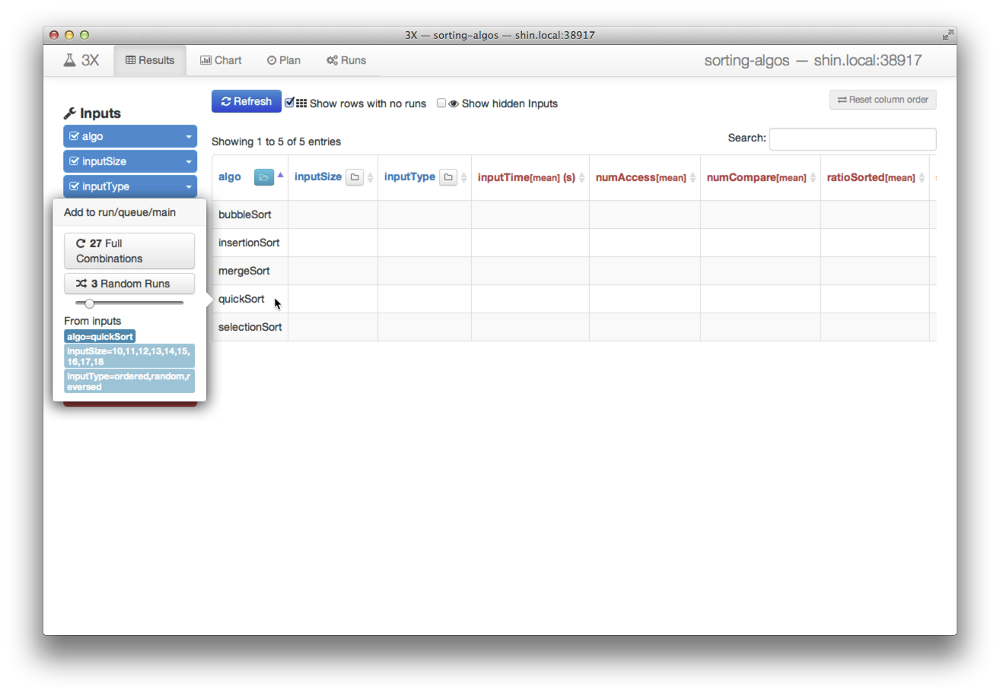

##### Queue Runs from Command Line

From the command line, within the experiment repository, the following command will achieve the same result as we did in the GUI:

    3x plan algo=quickSort

Different sets of runs can be easily queued with commands similar to the following:

    3x plan algo=bubbleSort,insertionSort inputSize=10,11,12

#### 3.3. Start Runs

The Runs tab shows a list of queues defined in the repository and the target
execution environment associated to them on the left-hand side.  On the
right-hand side table, all the runs added to the currently selected queue are
shown with their states and value bindings for input variables in the order
they will be executed.

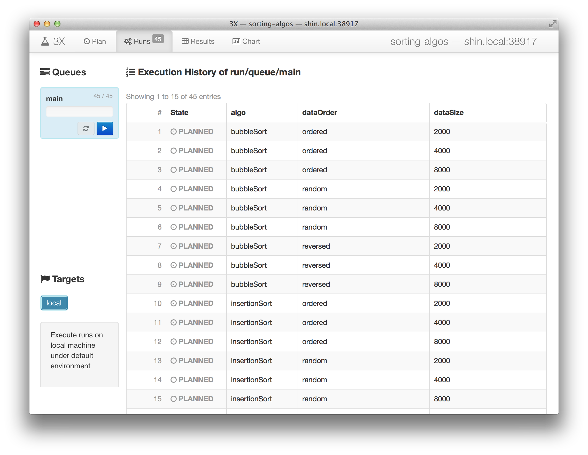

The buttons on the queue from the left-hand side list will let you to start and
stop the execution of the runs in it.  Pressing the play <i
class="icon-play"></i> button on the main queue starts the execution.

##### Start Runs from Command Line

From the command line, you can run the following command to view what runs are
in the current queue:

    3x status

It will output the table of runs in the current queue that resembles the GUI as
follows:

    PLANNED  algo=quickSort  inputSize=10  inputType=ordered   #1
    PLANNED  algo=quickSort  inputSize=10  inputType=random    #2
    PLANNED  algo=quickSort  inputSize=10  inputType=reversed  #3
    PLANNED  algo=quickSort  inputSize=11  inputType=ordered   #4
    [...]
    PLANNED  algo=quickSort  inputSize=18  inputType=random    #26
    PLANNED  algo=quickSort  inputSize=18  inputType=reversed  #27

To start execution, run:

    3x start

#### 3.4. Stop Runs

To stop the execution, press the pause <i class="icon-pause"></i> or stop <i
class="icon-stop"></i> button on the main queue.

##### Stop Runs from Command Line

To stop execution from the command line, either interrupt the `3x start`
process with Ctrl-C, or run the following command:

    3x stop

#### 3.5. Monitor Progress

As execution progresses, the state of runs will change from `PLANNED` to
`RUNNING`, then to either `DONE` or `FAILED` after finishing.

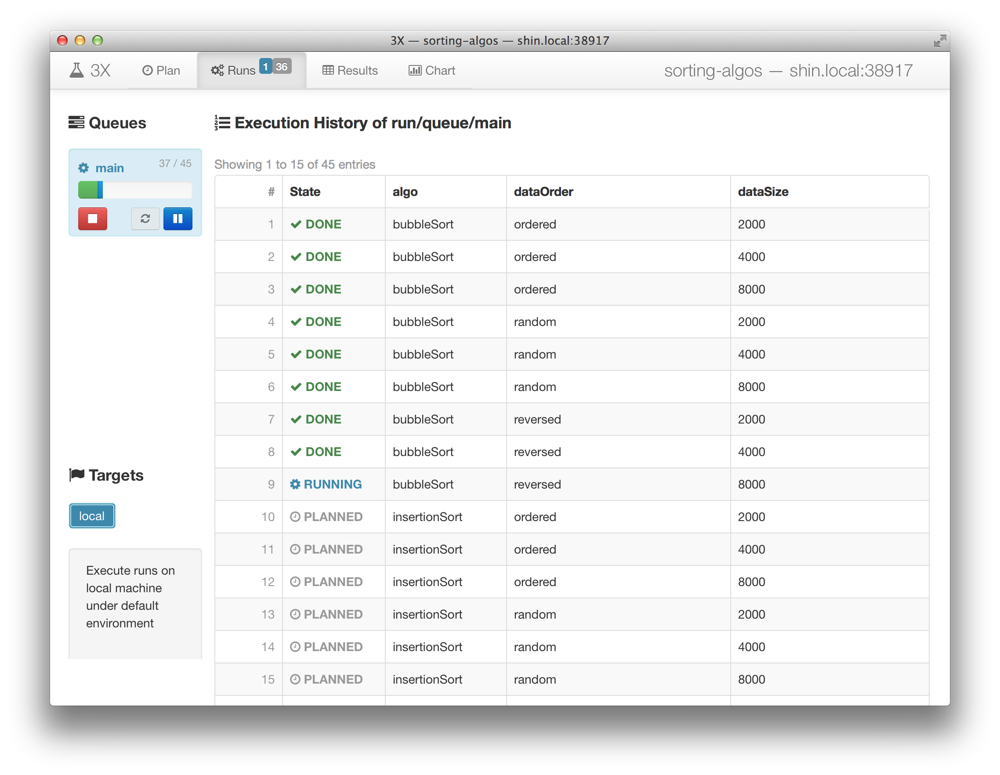

##### Monitor Progress from Command Line
From the command line, you can use the same command to view the state of runs
in the current queue:

    3x status

It will output the table of runs with updated states:

    DONE     algo=quickSort  inputSize=10  inputType=ordered   #1   local  run/2013/1001/01/1836.424138000-1
    DONE     algo=quickSort  inputSize=10  inputType=random    #2   local  run/2013/1001/01/1839.494897000-2
    DONE     algo=quickSort  inputSize=10  inputType=reversed  #3   local  run/2013/1001/01/1841.888092000-3
    DONE     algo=quickSort  inputSize=11  inputType=ordered   #4   local  run/2013/1001/01/1844.200499000-4
    DONE     algo=quickSort  inputSize=11  inputType=random    #5   local  run/2013/1001/01/1846.514245000-5
    [...]
    PLANNED  algo=quickSort  inputSize=18  inputType=random    #26
    PLANNED  algo=quickSort  inputSize=18  inputType=reversed  #27

#### 3.6. Trace Failures

If your program does not finish with clean (zero) exit status, or any error
occurs, their states become `FAILED`.  For example, if you forget to plug the
`.py` files into the `program/` directory, all runs fail as shown in the
following screenshot.  Additionally, if you stop the execution, runs can be
marked as `ABORTED`.

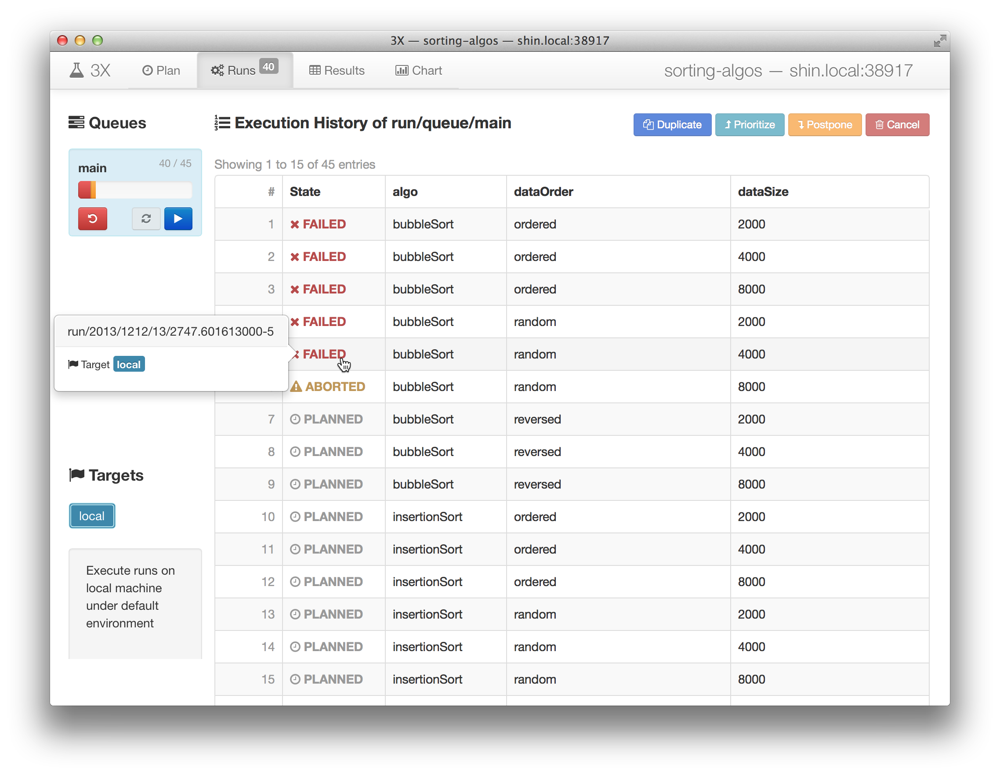

By following the link of a run in the state column (`FAILED`, `DONE`, or
`ABORTED`) of the execution history table, it is possible to access the full
record of the execution.

### 4. Explore Results

3X provides two main ways with its GUI to visualize and browse the result of
your experiment: with tables and charts.  Although limited in its capability
for exploration, 3X's CLI exposes many details of the result in tab-separated
textual form, which can be more useful for processing data with other
well-known command-line utilities.

#### 4.1. Tabulate Results

The Results tab in 3X's GUI shows the desired part of the result in a tabular
form with controls for filtering, aggregating, and projecting the input and
output variables to the table.

##### Filter results by selecting the values for input variables

<!-- Selection -->
You can select which part of the results you want to view by choosing the
values for the input variables individually.  The default when no value is
chosen for a input variable is to show all results of runs regardless of which
value was used for execution.

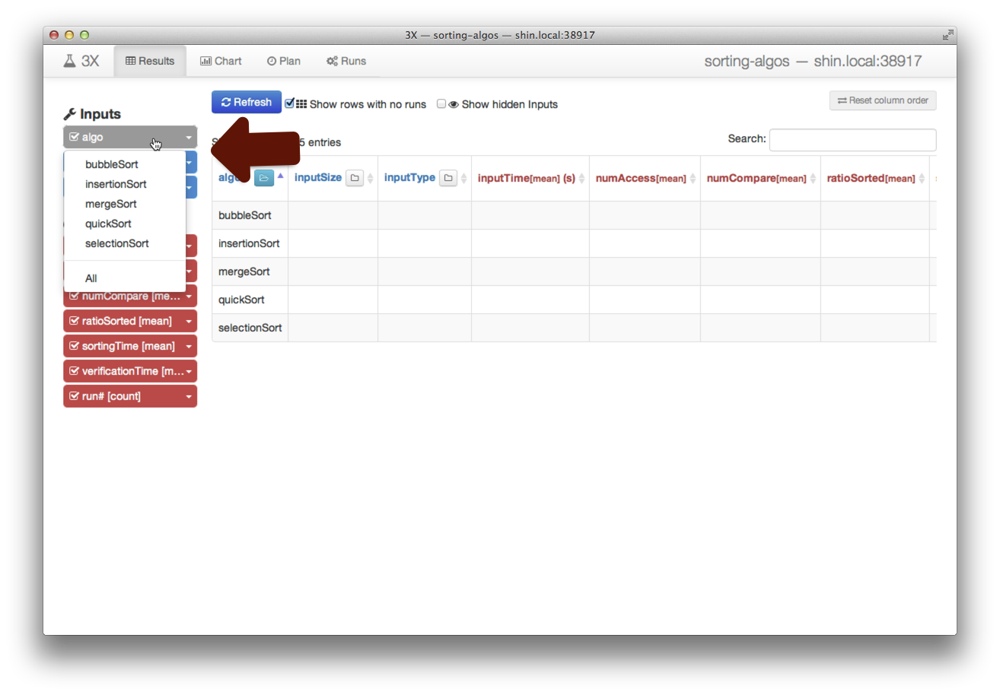

You can also specify what aggregate values of the output variables you want to
see as well as simple conditions on values of them, such as equality (`=1`) or
inequality (`<=12.345`) to a literal value.

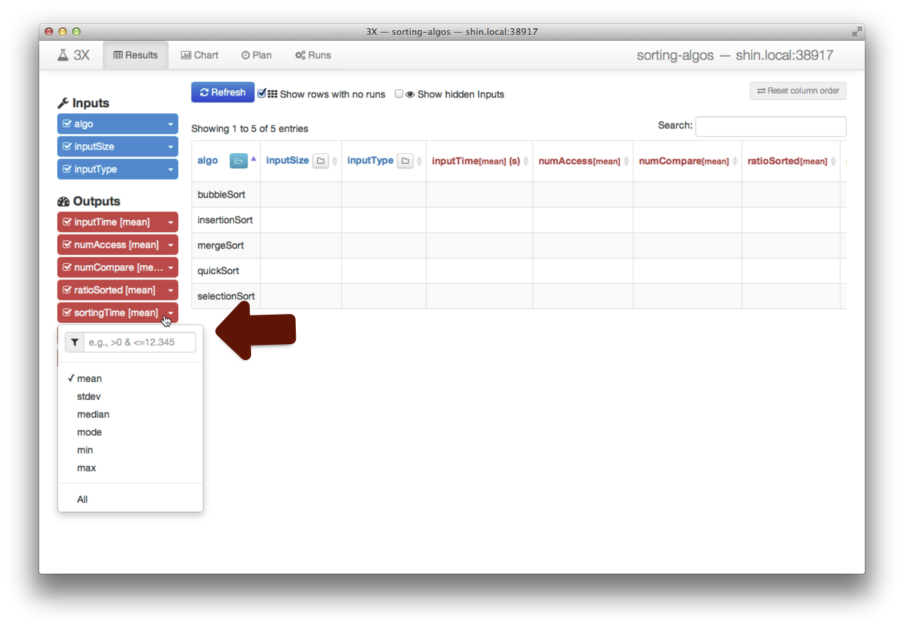

<!-- Projection -->
Note that it's possible to hide an unwanted variable from appearing in the
results by checking off its checkbox <i class="icon icon-check"></i>.<!--
to <i class="icon icon-check-empty"></i> -->

##### Aggregate results by some input variables

You can easily control by which input variables the results are grouped using
the buttons with folder icon labels <i class="icon icon-folder-open-alt"></i> <i
class="icon icon-folder-close-alt"></i> on the table header.
When you make a column expanded (indicated by the open folder icon <i
class="icon icon-folder-open-alt"></i>), individual values of that variable
will each have its own row in the results table.  All runs that were executed
using the particular value for a row will be grouped and the aggregate values
of their outputs will be shown in other columns.

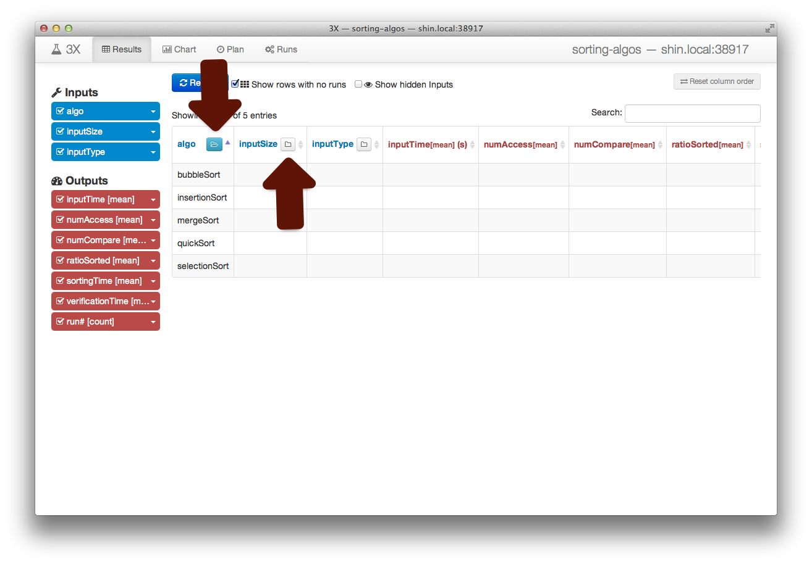

##### Sort results by columns and reorder columns

Clicking on one of the column name in the table header will sort the results
table by that column in ascending order.  Clicking again will reverse the order
to descending, and clicking once again will deactivate sorting for the
column.
By holding the Shift Key ⇧ down while clicking on another column header, you
can specify additional columns for sorting and give order to the results that
were ranked equally with previously chosen columns.
Dragging a column header to left or right direction will allow you to reorder
the columns to shape the table for easier examination.

#### 4.2. Chart Results

The Chart tab in 3X's GUI visualizes as a chart the data shown as a table in
the Results tab.

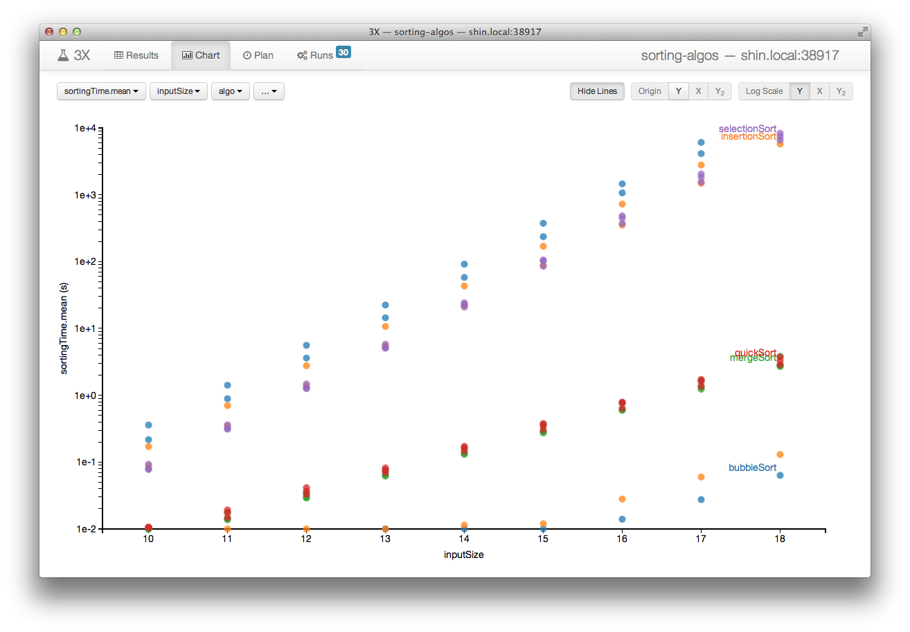

You can use the controls with pull down menus on the top-left corner of the
Chart tab to associate each column to either X- or Y-axis, or let the column
divide the data into different series.  The first variable selected is used as
the Y-axis, and the second one as the X-axis.  When more nominal variables are
selected, data that share common values of them will be drawn in the same
series in the chart.  When another numerical variable is further selected, it
may create a second Y-axis or share the first one depending on whether the
selected variables can share the *unit* for the Y-axes.

#### 4.3. Detail On-demand

Both chart and table shown in 3X's GUI are interactive: you can drill down to
details on-demand.

Clicking on any of the data points plotted in the chart shows a popover menu
displaying details of the subset of data that contributed to that point.  The
first row in the popover shows the Y-axis value, and the rest of the rows show
the X-axis value and other variables' values for the series.  If you click on
the number of runs (shown in the last row labeled `run#.count`), then you can
browse the individual values before aggregation, and follow the link on each
value to inspect the full record of the run that generated it.

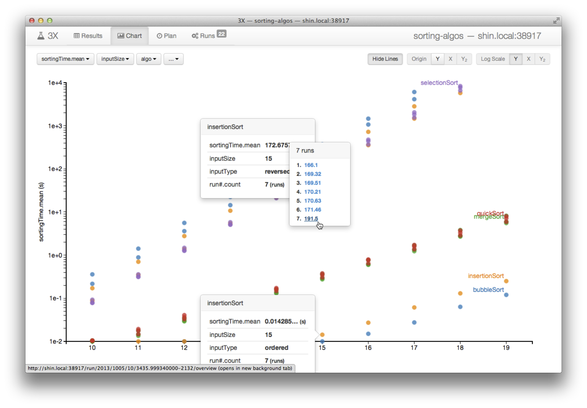

It's also possible to inspect individual values from the table.
By holding Shift Key ⇧ down while hovering over a cell that contains an
aggregated value, you can inspect each value that contributed to the aggregate
and access the full record of the run that generated the individual value as
well.

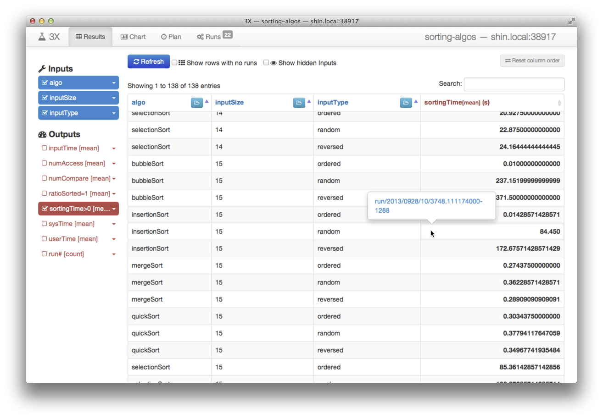

#### 4.4. Tabulate from command-line

Now, let's briefly take a look at the ways using the command-line interface to
obtain raw results data.  In fact, some of the commands shown here are exactly
identical to how the GUI accesses the data behind the scenes.

The following command will print full results of all executions containing the
value for each input and output variable prefixed with its name in a
tab-separated format and its run identifier on the first column.

    3x results run/

Part of whose output can look like:

    [...]
    run/2013/0924/18/1752.165321000-13    inputTime=0         numAccess=3069         numCompare=1023         ratioSorted=1  sortingTime=0        algo=insertionSort  inputSize=10  inputType=ordered
    run/2013/0924/18/1752.165321000-12    inputTime=0         numAccess=134201344    numCompare=33550336     ratioSorted=1  sortingTime=22.31    algo=bubbleSort     inputSize=13  inputType=reversed
    run/2013/0924/18/1752.165321000-15    inputTime=0         numAccess=1049598      numCompare=523776       ratioSorted=1  sortingTime=0.18     algo=insertionSort  inputSize=10  inputType=reversed
    run/2013/0924/18/1752.165321000-14    inputTime=0         numAccess=538588       numCompare=268780       ratioSorted=1  sortingTime=0.08     algo=insertionSort  inputSize=10  inputType=random
    run/2013/0924/18/1752.165321000-11    inputTime=0         numAccess=100600444    numCompare=33545965     ratioSorted=1  sortingTime=14.01    algo=bubbleSort     inputSize=13  inputType=random
    [...]
    run/2013/0930/23/5102.639230000-2064  inputTime=0         numAccess=34360262655  numCompare=34359607296  ratioSorted=1  sortingTime=7047.79  algo=selectionSort  inputSize=18  inputType=reversed
    run/2013/0930/23/5102.639230000-2059  inputTime=0.01      numAccess=34359869439  numCompare=34359607296  ratioSorted=1  sortingTime=7168.51  algo=selectionSort  inputSize=18  inputType=ordered
    run/2013/0930/23/5102.639230000-2060  inputTime=0.18      numAccess=34360655832  numCompare=34359607296  ratioSorted=1  sortingTime=8329.18  algo=selectionSort  inputSize=18  inputType=random
    run/2013/0930/23/5102.639230000-2058  inputTime=0.01      numAccess=34360262655  numCompare=34359607296  ratioSorted=1  sortingTime=8850.64  algo=selectionSort  inputSize=18  inputType=reversed

You can narrow down the output if you specify filters on some variables, e.g.:

    3x results algo=quickSort,mergeSort inputType'!='random numCompare'>'5900000

Then it outputs only the results that match given criteria:

    run/2013/0926/06/1826.875115000-888 	inputTime=0.01	numAccess=7134799	numCompare=5911655	ratioSorted=1	sortingTime=2.87	algo=quickSort	inputSize=18	inputType=ordered
    run/2013/0926/06/2351.112734000-1070	inputTime=0.01	numAccess=12805001	numCompare=5928316	ratioSorted=1	sortingTime=3.29	algo=quickSort	inputSize=18	inputType=reversed
    run/2013/0928/10/3748.111174000-1356	inputTime=0.01	numAccess=7168519	numCompare=5944051	ratioSorted=1	sortingTime=2.97	algo=quickSort	inputSize=18	inputType=ordered
    run/2013/0929/11/1246.771209000-1756	inputTime=0.02	numAccess=7345424	numCompare=6123288	ratioSorted=1	sortingTime=3.19	algo=quickSort	inputSize=18	inputType=ordered
    run/2013/0929/11/2047.444739000-1818	inputTime=0.01	numAccess=12120436	numCompare=5913122	ratioSorted=1	sortingTime=3.14	algo=quickSort	inputSize=18	inputType=reversed

* * *

## Example 2: Simulating Network Formations

Having a nice way to play with a few scalar values produced by your experiment
may sound good enough.  However, you are very likely to encounter a situation
where higher-dimensional output data, such as a time series result or a custom
visualization must be handled as well.  In this example, we will see how 3X
supports these requirements.

Suppose we have an experiment that studies the rise of a giant connected
component by gradually increasing the probability for creating edges between
vertices while generating random graphs.
We will borrow [code from an example displayed on the gallery
page][giant_component gallery] of *[NetworkX][]*, which is a popular Python
Library for handling Graph Data.

[NetworkX]: http://networkx.github.io/
[giant_component gallery]: http://networkx.github.io/documentation/latest/examples/drawing/giant_component.html

### 1. Write the Program

To be used most effectively with 3X, we make several changes to the code
borrowed from NetworkX:

1. Save the result as an image file, named `giant_component.png`, instead of showing it interactively in the GUI.
2. Obtain the originally hard-coded `p` and `n` values from corresponding environment variables instead.
3. Put a single generated graph in each result for a given `p` and `n` instead of iterating over several `p` values.
4. Keep a full record of the generated random graph.

Here is our code for this experiment: [`giant_component.py`][].

When this Python script is run with `n` and `p` defined, it produces an image
file `giant_component.png` that will look like:

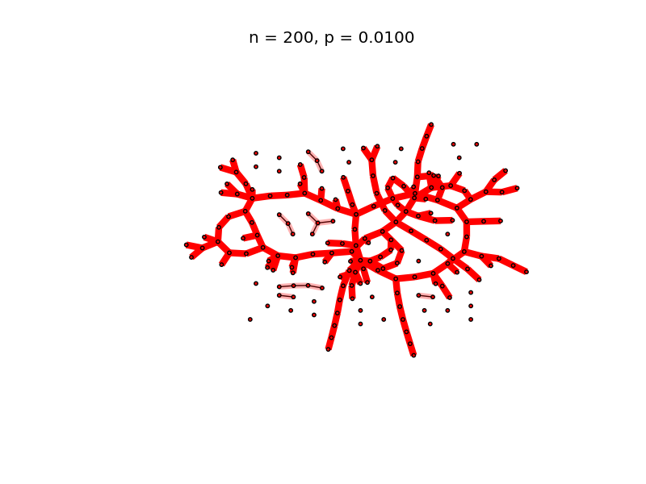

and a `graph.pickle` file in addition to standard output lines:

    Generated binomial graph (n=200, p=0.0100):
     0	[17, 60]
     1	[130]
     2	[129, 123, 116, 111]
     3	[122, 60, 125]
    [...]
     198	[128, 49, 155, 52]
     199	[149, 62]
    
    Created graph.pickle
    Created giant_component.png

[`giant_component.py`]: ../examples/giant_components/program/giant_component.py

### 2. Setup an Experiment Repository

We will use the following quick setup command to create a repository for this
experiment.  On the last line for `--outputs`, `--file` tells 3X that the
output variable `graph` is a file named `giant_component.png` with a MIME type
`image/png`.  3X GUI can treat output image files specially based on this
MIME-type user provides.

    3x setup giant_components \
        --program 'python ./giant_component.py' \
        --inputs  n=100,200,300 \
                  p=0.0{01..10} \
        --outputs --file graph:image/png=giant_component.png \
    #

Let's make sure to put the Python code at the correct place.

    cd giant_components/program/
    curl -LO https://netj.github.io/3x/docs/examples/giant_components/program/giant_component.py
    cd -

### 3. Run Experiments Many Times

We can move into the repository and execute full combinations of inputs by
running following commands:

    cd giant_components/
    3x plan n p
    3x start

Here, `3x plan` will open your text editor to let you reorder or duplicate some
of the runs.  You can simply save the presented file to confirm the runs and
add them to the queue.  Once you do a `3x start`, 3X will execute all the
previously planned runs in curent queue and stay executing future ones until
stopped by `3x stop`.  Therefore, we can now simply throw more runs into the
queue to get results from them.

Since each run of this experiment is non-deterministic, we need to execute each
input many times.  This can be done by running `3x plan` multiple times as
follows:

    3x plan n p
    3x plan n p
    3x plan n p
    [...]

Alternatively, you can duplicate the desired lines as many as you want using
your text editor without running the `3x plan` command multiple times.

### 4. Explore Results

3X GUI is essential for browsing the results since our only output variable is
of image type.

    3x gui

#### Aggregate image with *Overlay*

The `graph` column in the results table displays the PNG image files generated
by our experiment runs as in the following screenshot:

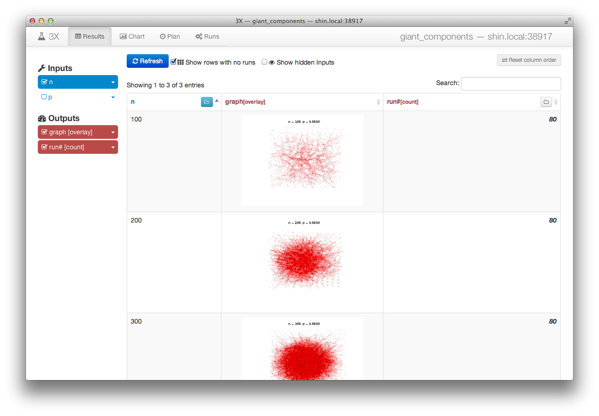

Notice here that 3X superimposes multiple images that fall into the same row,
i.e., renders images on top of each other, so that any patterns or variations
among them are easily discernible.  This feature is provided as a specialized
aggregate function, we call *overlay*, for image file type output variables.
Overlay aggregate function can be very useful when there isn't a good scalar
metric that summarizes the result or such metric is yet to be determined, and
the only way to judge is for humans to look at the images that visualizes the
higher-dimensional data.

#### Details on-demand

Individual images can be browsed one at a time using the same *details
on-demand* technique, hovering over the aggregate image or another aggregate
column while holding the Shift Key ⇧ down.

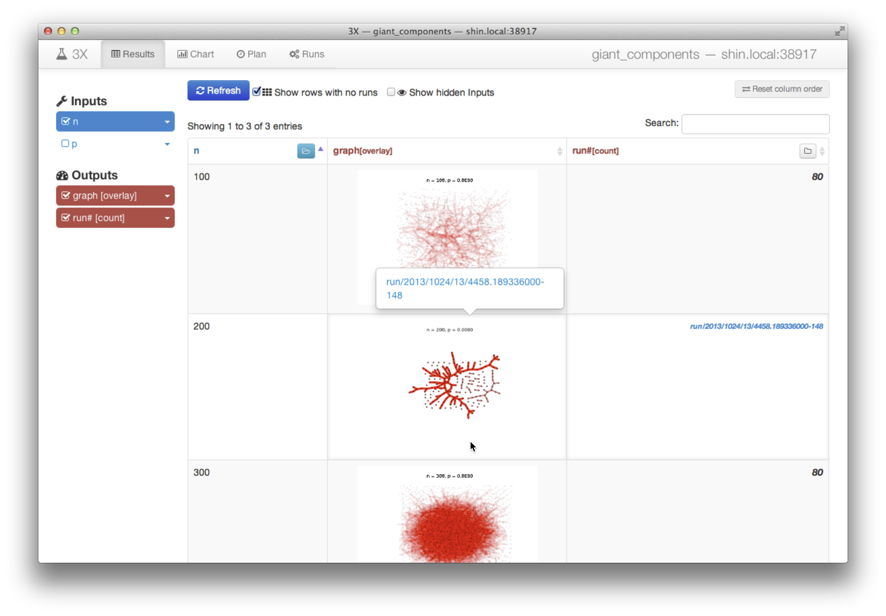

When you follow the link, the full record of the run is available as shown in
the following screenshot:

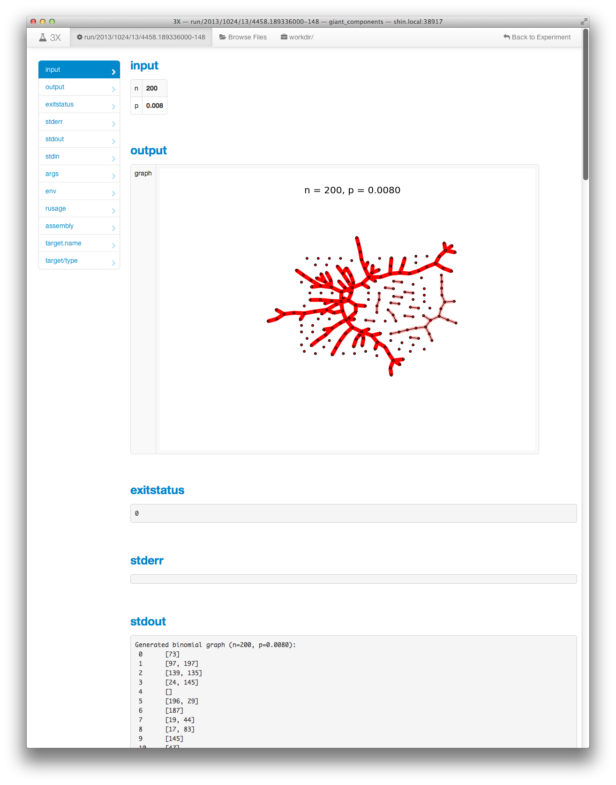

The run overview page shows the image for `graph` in full resolution as well as
the full standard output that records the exact details of the generated random
graph.  Any other files used for the run, such as `graph.pickle`, can be
accessed through the <i class="icon icon-briefcase"></i> "workdir/" tab at the
top of the page.

### 5. Analyze Results Further

Suppose you want to compute some statistics from the generated graphs after you
have seen a number of them.  For example, the number of components and how
large each of them may seem to be an interesting metric now.  Additionally, you
may be also interested in how long each run took to generate the graph and
image.

3X allows you to define output variables incrementally, i.e., new output
variables can be added later.  You can either use 3X's default options to
extract output values, or write a custom program that computes them.  3X's
default options are either extracting the first string that matches a triple of
regular expressions, or finding a generated file by name.  Here, we show all
three options.

#### Extract Execution Time from Built-in Records

As default, 3X records basic profile information for every run of your
experiment, such as execution time and maximum memory size using the *[GNU
time][]* utility in the file `rusage`.  You simply need to define an output
variable with correct regular expressions to extract those values from the
record.  For example, you can extract the elapsed wall clock time of your runs
as `wallTime` by running the following command:

    3x define output 'wallTime(s)' extract \
        'Elapsed \(wall clock\) time \(seconds\): '  '[0-9.]+'  '' \
        rusage

3X will not only extract values for `wallTime` from future runs but also rescan
records of past runs.

[GNU time]: http://www.gnu.org/s/time/

#### Compute Statistics

If a more complex computation is necessary to collect the values of interest,
then plugging in a custom *output extractor* code to 3X is your option.  In
fact, the two built-in options provided by `3x define output` command, namely
`extract` and `file` are mere shorthands for generating standard output
extractors.  More details on output extractors are described in the next
section.

For this experiment, let's say we want to see several statistics computed from
the generated graph, including the number of components that have more than one
vertex and the size of each component.  Since we dumped the graph to
`graph.pickle`, we can load this file and easily compute the necessary values.
[`compute-stats.py`][] is one such script that prints output similar to:

    Number of Components (non-singleton):  7
    Number of Disconnected Nodes (singleton components):  29
    Component Sizes:  153	4	4	3	3	2	2
    Component Size Ratios:  0.765000	0.020000	0.020000	0.015000	0.015000	0.010000	0.010000

We put this script directly under `output/` of the repository so it can be
assembled into the `outputs/` directory of each run and easily shared across
different output variables.

    cd output/
    curl -LO https://netj.github.io/3x/docs/examples/giant_components/output/compute-stats.py
    cd -

[`compute-stats.py`]: ../examples/giant_components/output/compute-stats.py

Next, we define an output variable, named `numCC`, by running the following
command:

    3x define output 'numCC' extract \
        'Number of Components.*:\s*' '\d+' '' \
        --running 'python outputs/compute-stats.py' \
        --caching compute-stats.txt

The command above does the following:

* It tells 3X to extract value for the variable `numCC`
    - using the regular expression triple `Number of Components.*:\s*`, `\d+`, `
      `, which are for matching the string before, of, and after the value of
      interest, respectively.
    - scanning the output of the `compute-stats.py` script, which is indicated
      by the command given after the argument `--running`.

* The output of the command will be cached at `outputs/.shared/compute-stats.txt`, so
  that other variables can be extracted without running it again.

Similarly, we can define several other variables, namely `numDisconnected`,
`ratioCC1`, `ratioCC2`, and `ratioCC3` from the output of the script:

    3x define output 'numDisconnected' extract \
        'Number of Disconnected Nodes.*:\s*' '\d+' '' \
        --running 'python outputs/compute-stats.py' \
        --caching compute-stats.txt
    
    3x define output 'ratioCC1' extract \
        'Component Size Ratios:\s*' '[.0-9]+' '' \
        --running 'python outputs/compute-stats.py' \
        --caching compute-stats.txt
    
    3x define output 'ratioCC2' extract \
        'Component Size Ratios:\s*[.0-9]+\s+' '[.0-9]+' '' \
        --running 'python outputs/compute-stats.py' \
        --caching compute-stats.txt
    
    3x define output 'ratioCC3' extract \
        'Component Size Ratios:\s*([.0-9]+\s+){2}' '[.0-9]+' '' \
        --running 'python outputs/compute-stats.py' \
        --caching compute-stats.txt

#### Notes on Output Extractors

In general, output extractor of a 3X output variable is a program that extracts
the value for that variable.  It takes the form of an executable file whose
name is `extract`.  You can use any language to implement it as long as the
first line contains a [shebang][] (`#!`) and its interpreter, or you name the
compiled executable binary accordingly.  Each output extractor is executed
after the experiment program (`run`) finishes, or when 3X rescans records of
past runs.  Its current working directory is set to the run directory, so all
files of the record can be easily accessed via relative paths, e.g., `stdout`
or `workdir/giant_component.py`.  It must not modify any files under `workdir/`
and should contain data creation and modifications under `outputs/` only.

[shebang]: https://en.wikipedia.org/wiki/Shebang_(Unix)

* * *

## Advanced Usage

Here we introduce a few more 3X features that are essential to more effective
management and execution of runs in your experiment.

### 1. Execute Runs in a Different Environment

To customize the environment in which planned runs are executed, or to execute
runs on a remote host or a cluster of hosts accessible via ssh, you can define
new *target execution environments*, or *target* as a shorthand.

#### Add another Local Target

Suppose we want to run our experiments with python3, which requires us to add
special values to some environment variables, namely `PATH` and `PYTHON3PATH`.

The following command defines a target named `local2` that customizes the
environment in the way we want.

    3x target local2  define local  PATH=/opt/python3/bin:"$PATH"  PYTHON3PATH=~/python3-packages

#### Add a Remote SSH Host Target

Suppose for a fair measurement of `sortingTime`, we want to execute the runs on
a shared remote machine instead of our local machine.  As long as the remote
machine is accessible via *ssh* (*Secure SHell*), 3X can execute runs on them
remotely and take care of the relevant data transfer forth and back.

The following command defines a target named `rocky` that executes runs on host
`rocky.Stanford.EDU` using the directory `~/3x-tmp/` for temporary storage.

    3x target rocky  define ssh  rocky.Stanford.EDU:3x-tmp/

To specify a username in addition to the hostname, prepend the username
followed by a `@`, e.g., `netj@rocky.Stanford.EDU`.  If your remote host uses a
non-standard SSH port (i.e., other than 22), then you can use the URL form to
specify its port as well, e.g., `ssh://netj@rocky.Stanford.EDU:22/3x-tmp/`.

As with local targets, you can specify customizations to the environment
variables after the URL for the remote, e.g. to tweak the `PATH` variable:

    3x target rocky  define ssh  rocky.Stanford.EDU:3x-tmp/  \
        PATH='/usr/local/python3/bin:/usr/local/bin:/usr/bin:/bin'

#### Add a GNU Parallel Cluster Target

*[GNU Parallel][]* is a handy tool for launching multiple processes of a
program, remotely as well as locally, in parallel to handle large amount of
inputs.  It is especially useful when we have SSH access to a cluster of remote
machines that does not have a dedicated job scheduler.  3X supports GNU
Parallel as a type of execution target, so you can get results of multiple runs
much earlier by leveraging the compute power of those ordinary machines.
You can simply specify a list of remote hosts and use it as another target
without knowing anything about GNU Parallel, since 3X abstracts away the
complex operation instructions for the tool.

[GNU Parallel]: https://www.gnu.org/software/parallel/

Following command defines a target named `corn`:

    3x target corn  define gnuparallel  /tmp/3x-tmp-netj/  .3x-remote  corn{01..30}.stanford.edu

that

* uses `/tmp/3x-tmp-netj/` as working directory on each machine, and 
* puts shared data under directory `~/.3x-remote/` assuming it is accessible
  across all machines
* with 30 machines: `corn01.stanford.edu`, ..., `corn30.stanford.edu`.
   <small>
  (Note that `{01..30}` is a special syntax for your shell to expand to 30
  words, which might not be supported by older versions.  In that case,
  enumerate all the names as arguments instead.)
  </small>

#### Switch between Targets

Now, assuming you have several targets defined in your repository, you can
switch target for current queue by specifying only the name of the target, as
shown in the following command for `rocky`:

    3x target rocky

After switching, you can start executing on the new target by running:

    3x start

To switch back to the `local` target, run:

    3x target local

More usage related to 3X targets can be accessed via the following command:

    3x target -h

### 2. Use Multiple Queues

Any 3X command related to planning or executing runs operates on the *current
queue*.  Once you begin to use multiple targets, it could be convenient to use
separate queues for each target.

#### View Queue Status and the Current Queue

To check the status of every queue as well as which is the current queue, use
the command without any argument:

    3x queue

It will output something similar to:

    #  QUEUE       STATE     #PLANNED  #RUNNING  #ABORTED  #FAILED  #DONE  TARGET
    *  main        INACTIVE  22        0         0         28       2137   local

The asterisk character `*` in front of the queue name indicates it is the
current queue.

#### Add and/or Switch to a Different Queue

To add a new queue, simply specify the name of the queue to the `3x queue`
command, say `test-queue`:

    3x queue test-queue

It will output lines similar to the following, indicating a new empty queue is
created:

    #  QUEUE       STATE     #PLANNED  #RUNNING  #ABORTED  #FAILED  #DONE  TARGET
    *  test-queue  INACTIVE  0         0         0         0        0      ?
       main        INACTIVE  22        0         0         28       2137   local

If you specify name of an existing queue, 3X will simply change the current
queue to that one.

#### Set the Target for a Queue

To specify which target to use for the current queue, use the following command:

    3x target corn

You can also specify the target to be used for the queue at the time you create
or switch to the queue:

    3x queue test-queue corn

It will also set the target for the queue:

    #  QUEUE       STATE     #PLANNED  #RUNNING  #ABORTED  #FAILED  #DONE  TARGET
    *  test-queue  INACTIVE  0         0         0         0        0      corn
       main        INACTIVE  22        0         0         28       2137   local

More usage related to 3X queues can be viewed via the following command:

    3x queue -h

The concept of current queue only applies to the commands of command-line
interface: 3X GUI will provide separate buttons and listings for each queue to
control and manage them.

